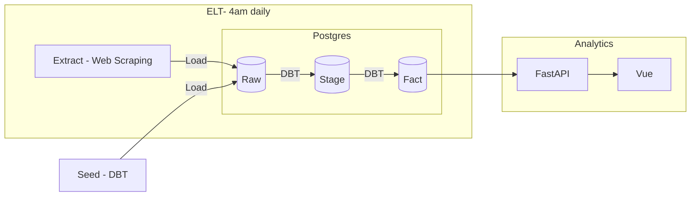

# NCAA Basketball Top 25 - V2

A project to see the week ahead for the top 25 NCAA Basketball teams in both Men's and Women's, using the following tools:
- DBT - https://www.getdbt.com/
- Prefect - https://www.prefect.io/
- FastAPI - https://fastapi.tiangolo.com/
- Vue3 - https://vuejs.org/

# Live Demo
http://ncaabtop25.com/

# Table of Contents
- [Data Pipeline](#data-pipeline)
- [Project Overview](#project-overview)
  - [Data Extract and Load](#data-extract-and-load)
  - [Data Transformation (DBT)](#data-transformation-dbt)
  - [API](#api)
  - [Presentation (Vue)](#presentation-vue)
- [Deployemnt](#deployment)

# Data Pipeline
Below is a high level overview of how data flows throughout the project



DBT Seed is run initially. Prefect then automatically triggers the ELT every day at 4 am EST, which scrapes ESPN, loads the scraped data into the database, and then calls DBT run and DBT test. The analytics layer connects to the final fact data, allowing the user to select Men's or Women's and the week.

# Project Overview

- [Data Extract and Load](#data-extract-and-load)
- [Data Transformation (DBT)](#data-transformation-dbt)
- [API](#api)
- [Presentation (Vue)](#presentation-vue)
- [File Structure](#file-structure)

## Data Extract and Load

### Initial Seed
A leagues.csv file and a weeks.csv file are both initially loaded to the data raw schema of the database. The leagues.csv file contains entries for Men's and Women's leagues and their display names. The weeks.csv file contains a list of weeks in the current season and their start and end dates.

### Recurring Loads
Data is extracted from ESPN using a python script. The script checks the top 25 rankings for each available week in the current year, then gathers the schedules for all the distinct teams that were in the top 25. This process occurs for both men's and women's data. The data is then loaded into 4 tables:
- raw_mens_schedules
- raw_womens_schedules
- raw_womens_week_rankings
- raw_mens_week_rankings

## Data Transformation (DBT)
DBT is used to clean and transform the data for use in the analytics layer. Since we want the user to be able to select Men's or Women's, we transform the separate raw tables for men's and women's into combined tables, qualified by the league_id from the initial seed. Also, teams data is not normalized in the raw structure, the DBT models handle creating the table that holds the espn_team_ids and relevant team information.

## API 
The API is built with FastAPI. There are 3 endpoints: one to get all leagues, one to get all weeks, and one to get the top 25 teams for the selected league and week, with nested list of games scheduled for that week.

## Presentation (Vue)
Vue3 is used to display the data from the API. The teams are displayed in order of ranking. To see the team name, hover, click or tap on the team logo. The score is always listed Home - Away, the color of the box indicates whether the ranked team won (green) or lost (red).

## File Structure

The project is structured as follows:

```
├───week_in_review
│   ├───api
│   ├───data
│   │   ├───extract_load
│   │   └───transform
│   ├───db
│   └───frontend
```
- api - contains all code related to the API
- data/extract_load - contains Prefect orchestration code and the python scraping script
- data/transform - contains the dbt project
- db - used as volume for the docker deployment of the postgress database
- frontend - contains all code for the Vue project

# Deployemnt
This is designed to run in docker with minimal setup. 
## Preqs
There are 2 main configuration items to complete.

Create a .env file in the root directory (the same folder as the docker compose files). Below is a sample of what is should contain
```
POSTGRES_DB=    #the name of the database
POSTGRES_USER=  #name of the 
POSTGRES_PASSWORD=  #strong password
COMPOSE_PROJECT_NAME=   #Docker related variable that configures the name of the stack when using docker compose (helpful for creating new containers for dev/uat on the same device)
```

Create a .env.production file in the frontend/ncaab_vue_frontend folder with the following:
```
VITE_API_BASE_URI=  #the endpoint url for the api container (default is http://localhost:85). This should match the port in the docker-compose.yml file or if using a reverse proxy, the url pointing to that port
```


## Docker Compose
Run the following command to build and run the containers. Note that it will take a minute or two for the database to populate on first run 
```
docker compose -f "docker-compose-prod_v2.yml" up -d --build
```
